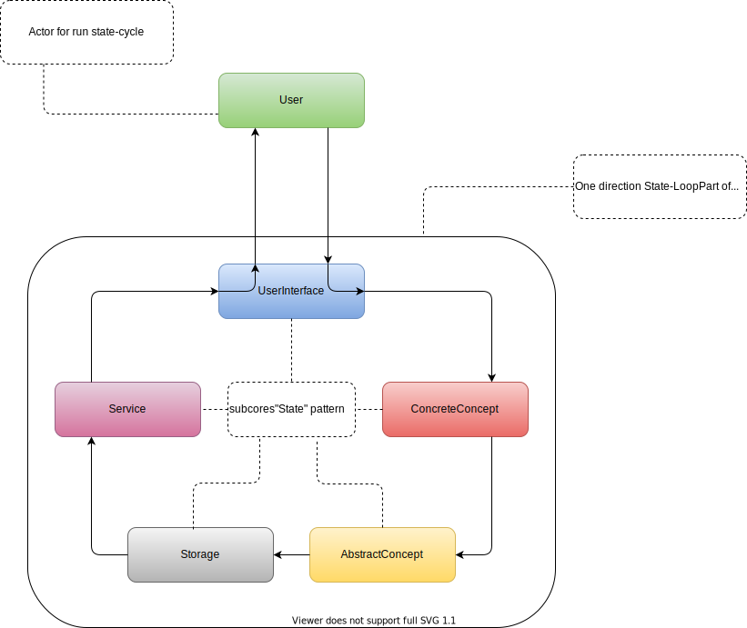
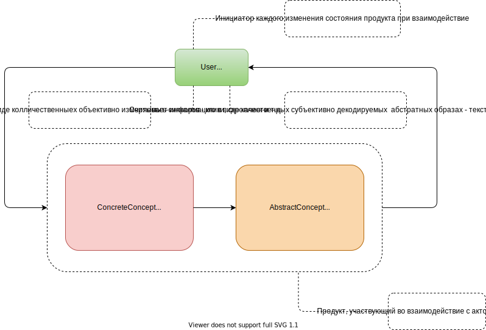

# gamebook

## Подсистемы ядра
- **UserInterface**  
  Драйвер I/O проекта
- **ConcreteConcept**  
  Конкретная (техническая) составляющая в объективном численно-колличественном эквиваленте : игромеханические вычисления, численные значения параметров и т.д.
- **AbstractConcept**  
  Абстрактная (гуманитарная) составляющая в субъективном абстрактно-качественном эквиваленте : нарративные текста, визуально-графические элементы и т.д.
- **Storage**   
  Хранение и обработка данных и состояния системы
- **Service** 
  Обслуживание задачь за рамками интерактивного взаимодействия Пользователь-Продукт

## Цикл взаимодействия между пользователь и продуктом

## Однонаправленный цикл состояний внутри ядра операционной системы проекта

Подсистемы ядра обязаны являться имплементацией паттерна **Состояние**.
Цикл состояний обязан является имплементацией паттернов **Мидиатор**

## Последовательность типов мышления в системе

