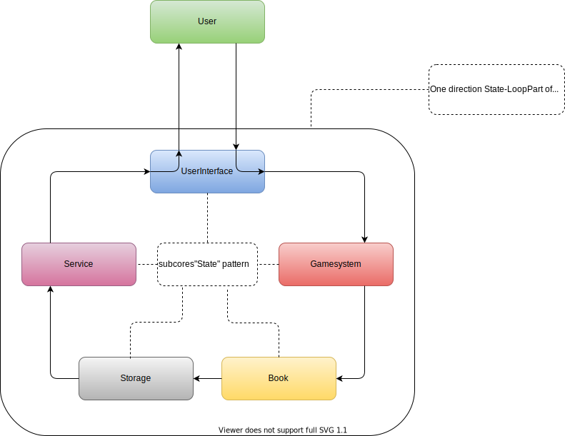

# gamebook

# Цикл взаимодействия между пользователь и продуктом

# Однонаправленный цикл состояний внутри ядра операционной системы проекта

Подсистемы ядра обязаны являться имплементацией паттерна Состояние
Цикл состояний обязан является имплементацией паттернов Мидиатор

